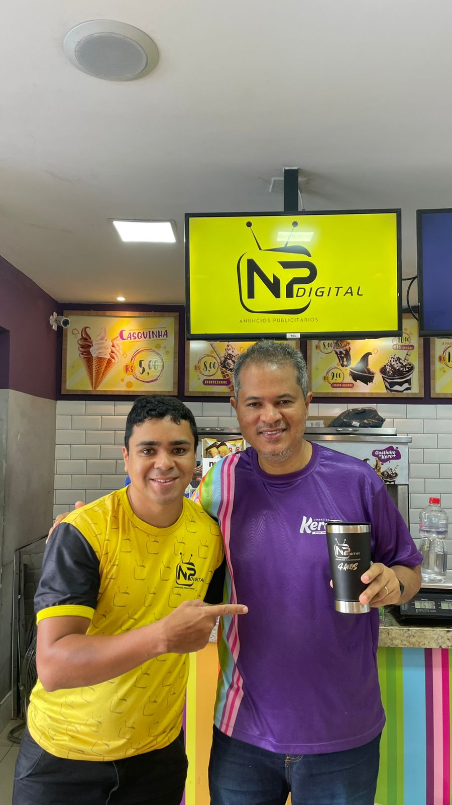
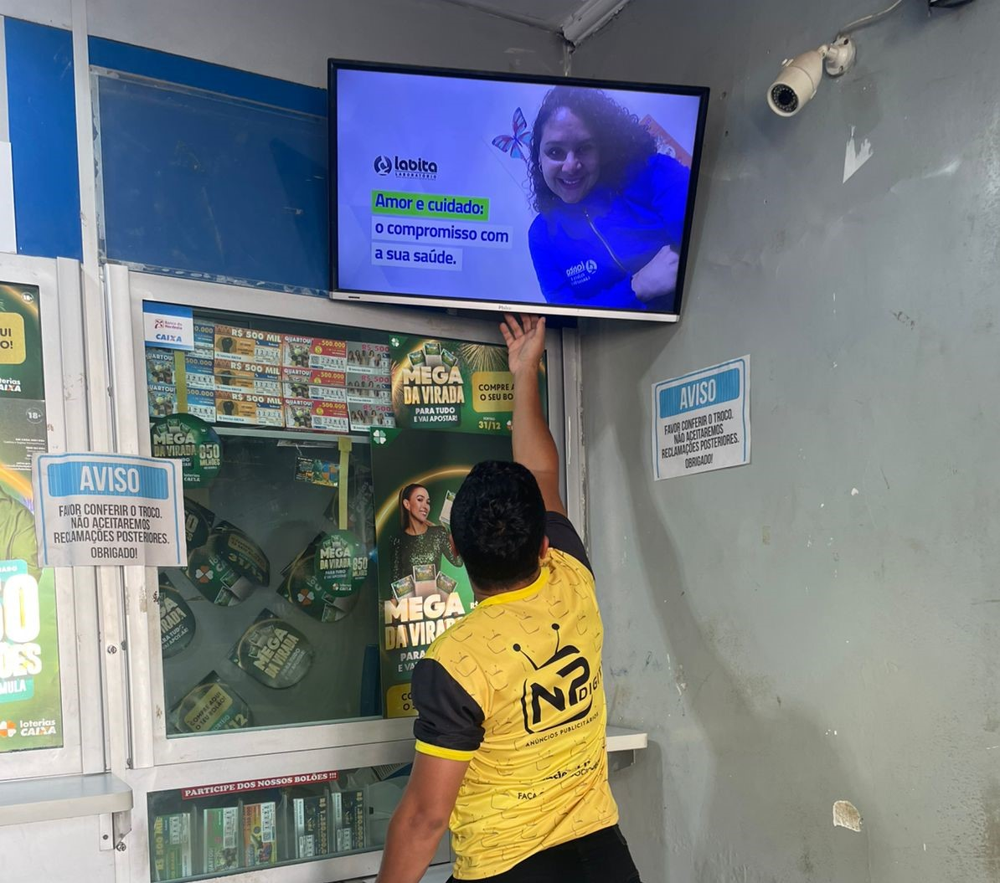
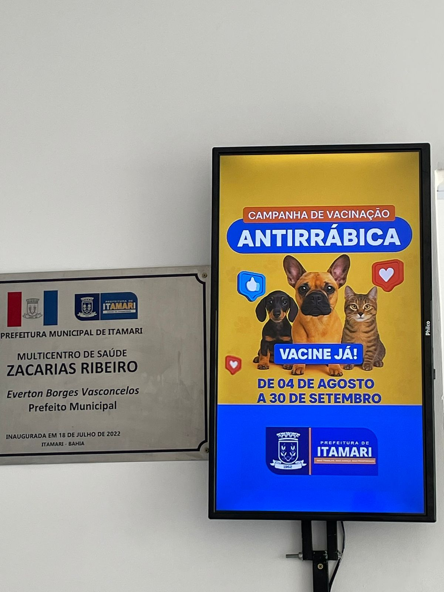

# NP DIGITAL CODES

**INDEX.HTML**

<!DOCTYPE html>

<html lang="pt-br">

<head>

&nbsp;   <meta charset="UTF-8">

&nbsp;   <meta name="viewport" content="width=device-width, initial-scale=1.0">

&nbsp;   <title>NP Digital</title>

&nbsp;   <!-- OPEN GRAPH (WhatsApp / Instagram / Facebook) -->

<meta property="og:title" content="NP Digital - Publicidade e Design">

<meta property="og:description" content="Transformando ideias em resultados! Confira nossos serviços de publicidade e design.">

<meta property="og:image" content="https://npdigitalpublic.github.io/npdigital/preview.png">

<meta property="og:type" content="website">

<meta property="og:url" content="https://npdigitalpublic.github.io/">

<meta name="theme-color" content="#FB9B00">

&nbsp;   <link rel="stylesheet" href="style.css">

&nbsp;   <link href="https://fonts.googleapis.com/css2?family=Akshar:wght@300;400;500;600;700\&display=swap" rel="stylesheet">

&nbsp;   <link rel="icon" type="image/png" href="fundoamarelo.PNG">

&nbsp;   <meta name="twitter:card" content="summary\_large\_image">

<meta name="twitter:title" content="NP Digital - Publicidade e Design">

<meta name="twitter:description" content="Transformando ideias em resultados!">

<meta name="twitter:image" content="https://npdigitalpublic.github.io/npdigital/preview.png">

</head>

<body>

&nbsp;   <header class="header">

&nbsp;       

&nbsp;       
Transformando ideias em resultados!

&nbsp;   </header>

&nbsp;  

&nbsp;   <a href="https://wa.me/5573999413413" target="\_blank">

&nbsp;       

&nbsp;   </a>

&nbsp;   <a href="https://www.instagram.com/npdigital\_publicidade" target="\_blank">

&nbsp;       

&nbsp;   </a>

&nbsp;   <section class="sobre-nos">

&nbsp;       

&nbsp;       <h1>SOBRE NÓS</h1>

&nbsp;       

&nbsp;           A NP Digital atua no mercado há 4 anos, ajudando empresas e empreendedores a crescerem 

&nbsp;           através da publicidade e design criativo.

&nbsp;       

&nbsp;       

&nbsp;       <button class="btn-servicos">Conheça os nossos serviços!</button>

&nbsp;       <h3 class="titulo-locais">LOCAIS DE ATENDIMENTO:</h3>

&nbsp;       

&nbsp;   <strong>📍 Apuarema</strong>\&nbsp;\&nbsp;

&nbsp;   <strong>📍 Gandu</strong>\&nbsp;\&nbsp;

&nbsp;   <strong>📍 Itamari</strong>\&nbsp;\&nbsp;

&nbsp;   <strong>📍 Nova Ibiá</strong>\&nbsp;\&nbsp;

&nbsp;   <strong>📍 Piraí do Norte</strong>\&nbsp;\&nbsp;

&nbsp;   <strong>📍 Teolândia</strong>

&nbsp;    

&nbsp;   <strong class="cidade-unica">📍 Wenceslau Guimarães</strong>

&nbsp;   </section>

</body>

</html>

-----------------------------------------------------------------------------------------------

**style.css**

body {

&nbsp;   font-family: 'Akshar', sans-serif;

}

body {

&nbsp;   margin: 0;

&nbsp;   padding: 0;

&nbsp;   background: #FFCC00; /\* Amarelo do Figma \*/

&nbsp;   font-family: Arial, sans-serif;

&nbsp;   text-align: center;

}

/\* Fade-out ao trocar de página \*/

body.fade-out {

&nbsp;   opacity: 0;

&nbsp;   transition: opacity 0.4s ease;

}

/\* Topo com logo \*/

.header {

&nbsp;   padding-top: 40px;

}

/\* Animação da logo descendo \*/

.logo {

&nbsp;   width: 180px;

&nbsp;   animation: slideDown 1.2s ease forwards;

&nbsp;   opacity: 0;

&nbsp;   transform: translateY(-60px);

}

@keyframes slideDown {

&nbsp;   to {

&nbsp;       opacity: 1;

&nbsp;       transform: translateY(0);

&nbsp;   }

}

.icones-sociais {

&nbsp;   display: flex;

&nbsp;   justify-content: center;

&nbsp;   gap: 20px;

&nbsp;   margin-top: 10px;

}

.icone-social {

&nbsp;   width: 48px;

&nbsp;   height: 48px;

&nbsp;   cursor: pointer;

&nbsp;   transition: transform 0.25s ease;

}

.icone-social.insta {

&nbsp;   width: 56px;   /\* Ajuste o tamanho até ficar igual ao WhatsApp \*/

&nbsp;   height: 56px;

&nbsp;   margin-top: -3px; /\*pra subir o icone do insta\*/

}

.icone-social:hover {

&nbsp;   transform: scale(1.15);

}

.slogan {

&nbsp;   margin-top: -5px;

&nbsp;   margin-bottom: 10px;

&nbsp;   font-size: 22px;     /\* AUMENTA O TAMANHO \*/

&nbsp;   font-weight: 700;    /\* NEGRITO \*/

&nbsp;   color: #000;

&nbsp;   letter-spacing: 0.5px;

}

/\* Sessão SOBRE NÓS \*/

.sobre-nos {

&nbsp;   margin-top: -20px;

&nbsp;   padding: 20px;

}

.sobre-nos h1 {

&nbsp;   font-size: 28px;

&nbsp;   font-weight: bold;

}

.descricao {

&nbsp;   margin: 10px auto;

&nbsp;   max-width: 600px;

&nbsp;   font-size: 22px;

&nbsp;   line-height: 1.5;

}

.linha {

&nbsp;   width: 180px;

&nbsp;   height: 3px;

&nbsp;   background: #000;

&nbsp;   margin: 20px auto;

}

/\* Botão branco \*/

.btn-servicos {

&nbsp;   background: white;

&nbsp;   border: 2px solid black;

&nbsp;   padding: 15px 25px;

&nbsp;   border-radius: 10px;

&nbsp;   font-size: 18px;

&nbsp;   font-weight: bold;

&nbsp;   cursor: pointer;

&nbsp;   transition: 0.25s;

}

.btn-servicos:hover {

&nbsp;   background: #FB9B00; 

&nbsp;   color: rgb(0, 0, 0);

&nbsp;   transform: scale(1.05);

}

/\* Animação do botão pulando \*/

@keyframes pulse {

&nbsp;   0% { transform: scale(1); }

&nbsp;   50% { transform: scale(1.09); }

&nbsp;   100% { transform: scale(1); }

}

.btn-servicos {

&nbsp;   animation: pulse 1.6s infinite ease-in-out;

}

/\* Locais \*/

.titulo-locais {

&nbsp;   margin-top: 30px;

&nbsp;   font-size: 20px;

}

.locais {

&nbsp;   margin-top: 10px;

&nbsp;   font-size: 17px;

&nbsp;   max-width: 700px;

&nbsp;   margin: auto;

}

/\* Estilo das cidades \*/

.locais strong {

&nbsp;   font-weight: 700;

&nbsp;   display: inline-block;

&nbsp;   transition: transform 0.2s ease;

&nbsp;   cursor: default;

}

/\* Animação ao passar o mouse \*/

.locais strong:hover {

&nbsp;   transform: scale(1.15);

}

.menu {

&nbsp;   display: flex;

&nbsp;   gap: 25px;

&nbsp;   justify-content: center;

&nbsp;   margin-top: 15px;

&nbsp;   font-size: 18px;

}

.menu a {

&nbsp;   text-decoration: none;

&nbsp;   color: black;

&nbsp;   font-weight: bold;

&nbsp;   transition: 0.2s;

}

.menu a:hover {

&nbsp;   color: #FB9B00;

&nbsp;   transform: translateY(-3px);

}

@media (max-width: 600px) {

&nbsp;   .menu {

&nbsp;       flex-direction: column;

&nbsp;       gap: 10px;

&nbsp;   }

}

.foto-redonda {

&nbsp;   transition: 0.3s;

}

.foto-redonda:hover {

&nbsp;   transform: scale(1.08);

&nbsp;   box-shadow: 0px 8px 18px rgba(0,0,0,0.35);

}

.voltar {

&nbsp;   background: #FB9B00;

&nbsp;   padding: 10px 20px;

&nbsp;   border: none;

&nbsp;   font-size: 16px;

&nbsp;   color: white;

&nbsp;   border-radius: 8px;

&nbsp;   cursor: pointer;

&nbsp;   margin: 20px;

&nbsp;   transition: 0.2s;

}

.voltar:hover {

&nbsp;   background: #d98700;

&nbsp;   transform: scale(1.05);

}

h1, h2, h3 {

&nbsp;   font-weight: 700;

}

p {

&nbsp;   font-weight: 400;

}

.btn-servicos {

&nbsp;   font-weight: 600;

}

-----------------------------------------------------------------------------------------------

**serviços.html**

<!DOCTYPE html>

<html lang="pt-br">

<head>

&nbsp;   <meta charset="UTF-8">

&nbsp;   <meta name="viewport" content="width=device-width, initial-scale=1.0">

&nbsp;   <title>NP Digital</title>

&nbsp;   <link rel="stylesheet" href="servicos.css">

&nbsp;   <link href="https://fonts.googleapis.com/css2?family=Akshar:wght@300;400;500;600;700\&display=swap" rel="stylesheet">

&nbsp;   <link rel="icon" type="image/png" href="fundoamarelo.PNG">

</head>

<body>

&nbsp;   <header class="header-servicos">

&nbsp;   

&nbsp;   <h1 class="titulo-servicos">Nossos Serviços</h1>

&nbsp;   

</header>

&nbsp;   <section class="conteudo">

&nbsp;       

&nbsp;           
 <strong>Instalação de Painéis e Telas Publicitárias:</strong>  

&nbsp;           Implementação e gerenciamento de televisores e painéis digitais para exibição de anúncios e campanhas em locais estratégicos.

&nbsp;       

&nbsp;       

&nbsp;       

&nbsp;       

&nbsp;       

&nbsp;           
 <strong>Divulgação em Ambientes Públicos:</strong>  

&nbsp;           Veiculação de conteúdos informativos e promocionais em televisores instalados em repartições públicas e espaços de grande circulação.

&nbsp;       

&nbsp;       

&nbsp;       

&nbsp;       

&nbsp;       

&nbsp;           
 <strong>Comunicação para Órgãos Públicos:</strong>  

&nbsp;           Apoio na divulgação de ações e projetos municipais por meio de vídeos e mídias digitais atrativas.

&nbsp;       

&nbsp;       <section class="pacotes">

&nbsp;   <h2 class="animar">NOSSOS PACOTES</h2>

&nbsp;   

  <!-- ✅ Linha nova -->

&nbsp;   

&nbsp;       

&nbsp;   

&nbsp;   

&nbsp;       <h3>PACOTE 3 PONTOS</h3>

&nbsp;       
R$ 120,00

&nbsp;   

&nbsp;   

&nbsp;   

&nbsp;       <h3>PACOTE 5 PONTOS</h3>

&nbsp;       
R$ 150,00

&nbsp;   

&nbsp;   

&nbsp;   

&nbsp;       <h3>PACOTE 8 PONTOS</h3>

&nbsp;       
R$ 200,00

&nbsp;   

Aproveite e faça logo a sua propaganda!

A NP Digital espera por você!

&nbsp;   </section>

&nbsp;  <footer class="footer-contato">

&nbsp;   <h2 class="footer-title">Entre em Contato Conosco:</h2>

&nbsp;   

&nbsp;       <!-- 🔥 BLOCO WHATSAPP -->

&nbsp;       

&nbsp;           

&nbsp;           

&nbsp;           
(73) 99941-3413

&nbsp;       

&nbsp;       <!-- 🔥 BLOCO INSTAGRAM -->

&nbsp;       

&nbsp;           

&nbsp;           
@npdigital\_publicidade

&nbsp;       

&nbsp;   

</footer>

</body>

</html>

**-----------------------------------------------------------------------------**

**serviços.css**

.header-servicos {

&nbsp;   text-align: center;

&nbsp;   padding-top: 40px;

}

/\* Logo entrando da esquerda \*/

.logo-servicos {

&nbsp;   width: 160px;

&nbsp;   opacity: 0;

&nbsp;   transform: translateX(-80px);

&nbsp;   animation: slideLeft 1.2s ease forwards;

}

/\* Título + linha vindo de cima \*/

.titulo-servicos {

&nbsp;   font-size: 30px;

&nbsp;   margin-top: 20px;

&nbsp;   opacity: 0;

&nbsp;   transform: translateY(-60px);

&nbsp;   animation: slideDown 1.2s ease forwards 0.3s;

}

/\* Linha preta abaixo do título \*/

.linha-servicos {

&nbsp;   width: 180px;

&nbsp;   height: 3px;

&nbsp;   background: #000;

&nbsp;   margin: 10px auto 20px;

&nbsp;   opacity: 0;

&nbsp;   transform: translateY(-40px);

&nbsp;   animation: slideDown 1.2s ease forwards 0.6s;

}

.servicos-grid {

&nbsp;   display: grid;

&nbsp;   gap: 20px;

}

/\* Tablet pra cima → 2 colunas \*/

@media (min-width: 600px) {

&nbsp;   .servicos-grid {

&nbsp;       grid-template-columns: 1fr 1fr;

&nbsp;   }

}

/\* PC → 3 colunas \*/

@media (min-width: 900px) {

&nbsp;   .servicos-grid {

&nbsp;       grid-template-columns: 1fr 1fr 1fr;

&nbsp;   }

}

/\* ANIMAÇÃO – Logo vindo da esquerda \*/

@keyframes slideLeft {

&nbsp;   to {

&nbsp;       opacity: 1;

&nbsp;       transform: translateX(0);

&nbsp;   }

}

/\* ANIMAÇÃO – Título e linha descendo \*/

@keyframes slideDown {

&nbsp;   to {

&nbsp;       opacity: 1;

&nbsp;       transform: translateY(0);

&nbsp;   }

}

body {

&nbsp;   font-family: 'Akshar', sans-serif;

}

body {

&nbsp;   margin: 0;

&nbsp;   background: #FFCC00;

&nbsp;   font-family: Arial, sans-serif;

}

.topo {

&nbsp;   text-align: center;

&nbsp;   padding: 20px 0;

}

.logo {

&nbsp;   width: 150px;

}

.topo h1 {

&nbsp;   font-size: 28px;

&nbsp;   margin-top: 10px;

&nbsp;   border-top: 3px solid #000;

&nbsp;   padding-top: 10px;

&nbsp;   display: inline-block;

}

.conteudo {

&nbsp;   width: 90%;

&nbsp;   max-width: 900px;

&nbsp;   margin: auto;

&nbsp;   text-align: center;

}

.card {

&nbsp;   background: #fff;

&nbsp;   border-radius: 12px;

&nbsp;   padding: 20px;

&nbsp;   margin: 20px auto;

&nbsp;   max-width: 700px;

&nbsp;   font-size: 17px;

&nbsp;   line-height: 1.5;

&nbsp;   box-shadow: 0px 3px 8px rgba(0,0,0,0.15);

}

.foto-redonda {

&nbsp;   width: 200px;

&nbsp;   height: 200px;

&nbsp;   border-radius: 50%;

&nbsp;   object-fit: cover;

&nbsp;   margin: 10px;

&nbsp;   box-shadow: 0px 3px 8px rgba(0,0,0,0.2);

}

/\* Rodapé \*/

.footer-contato {

&nbsp;   background: #FFCC00; /\* amarelo do Figma \*/

&nbsp;   text-align: center;

&nbsp;   padding: 40px 20px;

&nbsp;   margin-top: 40px;

&nbsp;   border-top: 3px solid #000; /\* opcional, fica estiloso \*/

}

/\* TÍTULO \*/

.footer-title {

&nbsp;   font-size: 28px;

&nbsp;   font-weight: 700;

&nbsp;   margin-bottom: 20px;

}

/\* ÁREA CLICÁVEL \*/

.footer-whats-area {

&nbsp;   display: inline-flex;

&nbsp;   align-items: center;

&nbsp;   gap: 15px;

&nbsp;   cursor: pointer;

&nbsp;   background: #fff;

&nbsp;   padding: 14px 22px;

&nbsp;   border-radius: 12px;

&nbsp;   border: 2px solid #000;

&nbsp;   transition: transform 0.25s ease;

}

/\* HOVER \*/

.footer-whats-area:hover {

&nbsp;   background: #FB9B00;

&nbsp;   transform: scale(1.05);

}

/\* ÍCONE DO WHATS \*/

.footer-whats-icon {

&nbsp;   width: 55px;

&nbsp;   height: 55px;

}

/\* SETA DE CLIQUE \*/

.footer-seta {

&nbsp;   width: 40px;

&nbsp;   height: 40px;

&nbsp;   transform: rotate(-25deg); /\* 🔥 seta inclinada para o WhatsApp \*/

&nbsp;   animation: pulse 1s infinite;

}

/\* NUMERO \*/

.footer-numero {

&nbsp;   font-size: 20px;

&nbsp;   font-weight: 700;

}

/\* Animação da seta \*/

@keyframes pulse {

&nbsp;   0% { transform: translateX(0); }

&nbsp;   50% { transform: translateX(6px); }

&nbsp;   100% { transform: translateX(0); }

}

.whats {

&nbsp;   color: #000;

}

h1, h2, h3 {

&nbsp;   font-weight: 700;

}

p {

&nbsp;   font-weight: 400;

}

.footer-container {

&nbsp;   display: flex;

&nbsp;   justify-content: center;

&nbsp;   gap: 30px;         /\* espaço entre os blocos \*/

&nbsp;   flex-wrap: wrap;   /\* responsivo \*/

&nbsp;   margin-top: 20px;

}

.footer-bloco {

&nbsp;   background: #fff;

&nbsp;   padding: 16px 22px;

&nbsp;   border-radius: 14px;

&nbsp;   border: 2px solid #000;

&nbsp;   display: flex;

&nbsp;   align-items: center;

&nbsp;   gap: 12px;

&nbsp;   cursor: pointer;

&nbsp;   transition: 0.25s ease;

}

.footer-bloco:hover {

&nbsp;   background: #FB9B00;

&nbsp;   transform: scale(1.05);

&nbsp;   color: #fff;

}

/\* Ícone do Whats \*/

.footer-whats-icon {

&nbsp;   width: 55px;

}

/\* Ícone do Insta \*/

.footer-insta-icon {

&nbsp;   width: 55px;

}

/\* Seta inclinada \*/

.footer-seta {

&nbsp;   width: 40px;

&nbsp;   transform: rotate(-35deg);

&nbsp;   animation: pulse 1s infinite;

}

/\* Número \*/

.footer-numero {

&nbsp;   font-size: 18px;

&nbsp;   font-weight: 700;

}

.btn-servicos {

&nbsp;   font-weight: 600;

}

.card {

&nbsp;   background: #fff;

&nbsp;   border-radius: 12px;

&nbsp;   padding: 20px;

&nbsp;   margin: 20px auto;

&nbsp;   max-width: 700px;

&nbsp;   font-size: 17px;

&nbsp;   line-height: 1.5;

&nbsp;   box-shadow: 0px 3px 8px rgba(0,0,0,0.15);

&nbsp;   transition: 0.25s ease;

&nbsp;   cursor: pointer;

}

/\* ✅ Efeito laranja no hover \*/

.card:hover {

&nbsp;   background: #FB9B00;

&nbsp;   color: rgb(0, 0, 0);

&nbsp;   transform: scale(1.03);

&nbsp;   box-shadow: 0px 6px 16px rgba(0,0,0,0.3);

}

/\* Título da seção \*/

.pacotes h2 {

&nbsp;   font-size: 26px;

&nbsp;   margin-top: 40px;

&nbsp;   margin-bottom: 10px;

&nbsp;   font-weight: 700;

&nbsp;   text-align: center;

}

/\* Estilo dos cards de Pacotes \*/

.pacote-card {

&nbsp;   display: flex;

&nbsp;   align-items: center;

&nbsp;   background: #fff;

&nbsp;   border-radius: 14px;

&nbsp;   padding: 20px;

&nbsp;   margin: 20px auto;

&nbsp;   width: 90%;

&nbsp;   max-width: 650px;

&nbsp;   box-shadow: 0px 3px 10px rgba(0,0,0,0.2);

&nbsp;   transition: 0.25s ease;

&nbsp;   cursor: pointer;

}

/\* Logo do lado esquerdo \*/

.pacote-logo {

&nbsp;   width: 70px;

&nbsp;   height: 70px;

&nbsp;   object-fit: contain;

&nbsp;   margin-right: 20px;

}

/\* Texto dos pacotes \*/

.pacote-info h3 {

&nbsp;   margin: 0;

&nbsp;   font-size: 22px;

&nbsp;   font-weight: 700;

}

.pacote-info p {

&nbsp;   margin: 5px 0 0 0;

&nbsp;   font-size: 18px;

&nbsp;   font-weight: 600;

}

/\* Hover laranja igual aos cards \*/

.pacote-card:hover {

&nbsp;   background: #FB9B00;

&nbsp;   color: white;

&nbsp;   transform: scale(1.03);

&nbsp;   box-shadow: 0px 6px 16px rgba(0,0,0,0.3);

}

/\* Quando hover, deixa logo branca \*/

.pacote-card:hover .pacote-logo {

&nbsp;   filter: brightness(0) invert(1);

}

/\* Responsivo \*/

@media (max-width: 600px) {

&nbsp;   .pacote-card {

&nbsp;       flex-direction: row;

&nbsp;       justify-content: flex-start;

&nbsp;   }

&nbsp;   

&nbsp;   .pacote-logo {

&nbsp;       width: 55px;

&nbsp;       height: 55px;

&nbsp;       margin-right: 15px;

&nbsp;   }

&nbsp;   .pacote-info h3 {

&nbsp;       font-size: 20px;

&nbsp;   }

&nbsp;   .pacote-info p {

&nbsp;       font-size: 16px;

&nbsp;   }

}

.animar {

&nbsp;   opacity: 0;

&nbsp;   transform: translateY(40px);

&nbsp;   transition: all 0.7s ease;

}

.mostrar {

&nbsp;   opacity: 1;

&nbsp;   transform: translateY(0);

}

.pacotes {

&nbsp;   padding-bottom: 100px; /\* adiciona espaço para evitar cortes \*/

}

.pacote-card {

&nbsp;   display: flex;

&nbsp;   align-items: center;

&nbsp;   position: relative;

&nbsp;   z-index: 2; /\* força o card a aparecer acima de qualquer coisa \*/

}

/\* Linha abaixo do título "Nossos Pacotes" \*/

.linha-pacotes {

&nbsp;   width: 180px;              /\* mesmo tamanho da linha da página 1 \*/

&nbsp;   height: 3px;               /\* mesma espessura \*/

&nbsp;   background: #000;          /\* preto igual \*/

&nbsp;   margin: 10px auto 25px;    /\* centraliza e dá espaço abaixo \*/

&nbsp;   border-radius: 2px;

}

.frase-final {

&nbsp;   text-align: center;

&nbsp;   font-size: 24px;

&nbsp;   font-weight: 700;

&nbsp;   margin-top: 10px;

&nbsp;   margin-bottom: 15px; /\* 🔽 diminui o espaço entre as frases \*/

&nbsp;   color: #000;

}

**-------------------------------------------------------------------**

**jvscript**

window.addEventListener("DOMContentLoaded", () => {

&nbsp; 

&nbsp; // Fade-in do título

&nbsp; const header = document.querySelector("header h1");

&nbsp; if (header) {

&nbsp;   header.style.opacity = 0;

&nbsp;   header.style.transition = "opacity 1.5s";

&nbsp;   setTimeout(() => (header.style.opacity = 1), 300);

&nbsp; }

&nbsp; // --- Botão "Serviços" ---

&nbsp; const botaoServicos = document.querySelector(".btn-servicos");

&nbsp; if (botaoServicos) {

&nbsp;   botaoServicos.addEventListener("click", () => {

&nbsp;     mudarPagina("servicos.html");

&nbsp;   });

&nbsp; }

});

// Animação suave ao trocar de página

function mudarPagina(destino) {

&nbsp; document.body.classList.add("fade-out");

&nbsp; setTimeout(() => {

&nbsp;     window.location.href = destino;

&nbsp; }, 400);

}

const elementos = document.querySelectorAll(".animar");

function animarScroll() {

&nbsp;   elementos.forEach(el => {

&nbsp;       const posicao = el.getBoundingClientRect().top;

&nbsp;       const altura = window.innerHeight \* 0.8;

&nbsp;       if (posicao < altura) {

&nbsp;           el.classList.add("mostrar");

&nbsp;       }

&nbsp;   });

}

window.addEventListener("scroll", animarScroll);

animarScroll();

function abrirWhats() {

&nbsp;   window.open("https://wa.me/5573999413413", "\_blank");

}

function abrirInsta() {

&nbsp;   window.open("https://instagram.com/npdigital\_publicidade", "\_blank");

}

